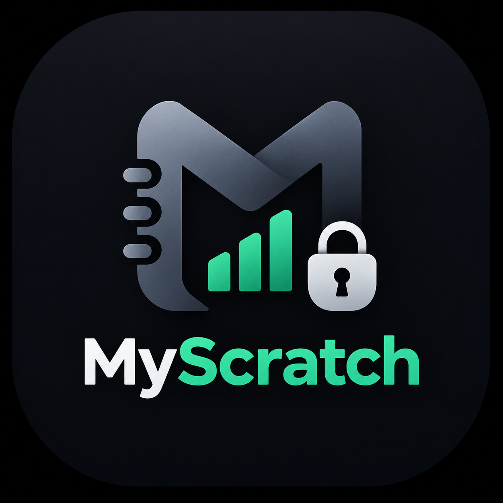

# MyScratch — Android Client

<p align="center">
  
</p>

<p align="center">
  <strong>Executive and Privacy-Focused Mobile Experience for Android</strong><br>
  Built with Kotlin, Jetpack Compose (Material 3), Clean Architecture, Room Database, and RESTful API Integration.
</p>

<p align="center">
  
  
  
  
  
</p>

---

## Ringkasan Aplikasi

MyScratch Client dirancang dengan estetika Executive Fintech (Dark Obsidian Palette) yang elegan, tipografi tajam, dan bebas dari ikon kartun atau emoji (menggunakan ikon vektor profesional Material Design).

Aplikasi ini mendukung tampilan responsif penuh di berbagai ukuran layar:
- **Smartphone (< 600dp)**: Navigasi bawah (Bottom Navigation Bar), kartu ringkasan ramping, dan form teroptimasi sentuhan satu tangan.
- **Tablet dan Layar Lebar (≥ 600dp)**: Navigation Rail di sisi samping, dasbor metrik multi-kolom, serta Master-Detail Dual-Pane untuk katalog dan editor catatan.

---

## Fitur Utama

### 1. Autentikasi dan Verifikasi OTP
- Registrasi dan verifikasi akun nyata melalui kode OTP 6-digit yang dikirimkan via email.
- Token otentikasi berbasis Bearer Token (Laravel Sanctum) yang tersimpan secara aman di perangkat.
- Manajemen profil lengkap: Ganti Password (verifikasi OTP), Ganti Email (verifikasi OTP), dan Penghapusan Akun mandiri.

### 2. Manajemen Keuangan dan Arus Kas (Finance Intelligence)
- **Dasbor Finansial Cerdas**:
  - Saldo Total dengan kalkulasi otomatis dari Pemasukan vs Pengeluaran.
  - Estimasi Kekayaan Bersih (Net Worth Assessment) memperhitungkan Piutang dan Hutang.
  - **Diagram Donat Interaktif**: Visualisasi persentase pengeluaran berdasarkan kategori secara real-time.
  - Filter periode waktu cepat: Semua, Bulan Ini, Minggu Ini, dan Hari Ini.
- **Kalkulator Pop-up Terintegrasi**:
  - Kalkulator terapung cepat yang dapat dibuka kapan saja tanpa keluar dari layar input.
  - Fitur "Gunakan Nilai Ini" (Apply Value): Hasil perhitungan langsung dimasukkan ke kolom nominal transaksi dalam satu ketukan.

### 3. Catatan Terenkripsi dan Manajemen Folder
- **Pengelompokan Folder**: Kustomisasi folder dengan pilihan warna aksen HEX.
- **Penyematan Catatan (Pinning)**: Sematkan catatan penting agar selalu tampil di bagian atas.
- **Pencarian Cepat**: Pencarian judul dan konten catatan secara instan.
- **Dual-Pane di Tablet**: Navigasi daftar catatan di sisi kiri dan editor aktif di sisi kanan.

### 4. Arsitektur Offline-First
- Didukung penyimpanan lokal Room Database (SQLite) dengan skema reaktif Kotlin Coroutines & Flow.
- Performa instan tanpa jeda saat membuka aplikasi, dengan sinkronisasi otomatis ke backend cloud REST API.

---

## Arsitektur Kode (Clean Architecture & MVVM)

Proyek ini menerapkan kaidah Clean Architecture yang terstruktur, rapi, dan modular:

```
com.myscratch.app
├── data/
│   ├── local/               # Room Database, DAOs, dan Entities (Offline Cache)
│   │   ├── dao/             # UserDao, TransactionDao, FolderDao, NoteDao
│   │   ├── entity/          # UserEntity, TransactionEntity, FolderEntity, NoteEntity
│   │   └── AppDatabase.kt   # Singleton Room Database instance
│   ├── network/             # Retrofit 2 REST Client
│   │   ├── api/             # MyScratchApiService definition
│   │   ├── dto/             # Data Transfer Objects (Auth, Finance, Notes, Profile)
│   │   ├── ApiClient.kt     # Retrofit & OkHttp client singleton
│   │   ├── AuthInterceptor.kt # Bearer token injection
│   │   └── TokenManager.kt  # Secure token storage
│   └── repository/          # Implementasi Repository (Auth, Finance, Notes)
│
├── domain/
│   ├── model/               # Pure Kotlin Domain Models (User, Transaction, Folder, Note)
│   └── repository/          # Abstraksi Interface Repository
│
├── ui/
│   ├── auth/                # LoginScreen, RegisterScreen, OtpVerificationScreen
│   ├── components/          # ClassyCard, ClassyTextField, DonutChart, PopupCalculatorDialog, ResponsiveScaffold
│   ├── finance/             # FinanceDashboardScreen, TransactionHistoryScreen, AddEditTransactionScreen
│   ├── home/                # HomeScreen (Pusat Navigasi Utama)
│   ├── navigation/          # AppNavGraph, Screen destinations
│   ├── notes/               # NotesMainScreen, NoteEditorScreen
│   ├── profile/             # ProfileScreen, Security Settings
│   └── theme/               # Color, Theme, Type (Obsidian Dark Executive Theme)
│
└── viewmodel/               # AuthViewModel, FinanceViewModel, NotesViewModel
```

---

## Panduan Menjalankan Aplikasi

### 1. Buka Proyek di Android Studio
- Buka Android Studio (versi Hedgehog 2023.1.1 atau yang lebih baru).
- Pilih **File > Open**, lalu arahkan ke direktori `FRONTEND`.
- Pastikan Gradle JDK menggunakan **JDK 17** (Settings > Build, Execution, Deployment > Build Tools > Gradle > Gradle JDK).

### 2. Konfigurasi Endpoint Backend
Buka file:
`app/src/main/java/com/myscratch/app/data/network/ApiClient.kt`

Sesuaikan `baseUrl` dengan alamat server backend Anda:
```kotlin
// Contoh untuk Emulator Android (mengarah ke localhost komputer pengembangan)
var baseUrl: String = "http://10.0.2.2:8000/api/"

// Contoh untuk Perangkat Fisik (mengarah ke IP LAN komputer Anda)
var baseUrl: String = "http://192.168.1.10:8000/api/"

// Contoh untuk Server Produksi / Cloud
var baseUrl: String = "https://myscratch-prod.vercel.app/api/"
```

### 3. Build & Jalankan
- Sambungkan emulator Android atau perangkat fisik dengan mode USB Debugging aktif.
- Tekan tombol **Run (Shift + F10)** pada Android Studio, atau jalankan melalui terminal:
  ```bash
  ./gradlew assembleDebug
  ```
- File APK hasil kompilasi tersedia di:
  `app/build/outputs/apk/debug/app-debug.apk`

---

## Privasi dan Keamanan
Kredensial pengguna disimpan secara aman di perangkat menggunakan token terotentikasi, dan semua data catatan serta memo transaksi dienkripsi secara transparan menggunakan enkripsi AES-256-CBC di sisi backend sebelum disimpan ke database.

---

## Lisensi dan Pembuat
Dikembangkan oleh **Ryan Hidayat** ([@RyanHidayat058](https://github.com/RyanHidayat058)).  
Hak cipta dilindungi undang-undang.
