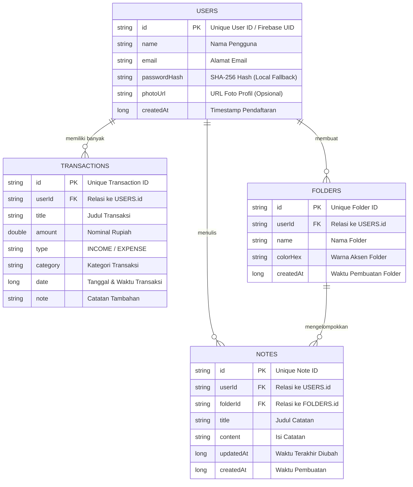

# MyScratch 💼📝
> **Aplikasi Android Modern & Berkelas untuk Manajemen Keuangan & Catatan Terstruktur.**  
> Dibangun dengan **Kotlin**, **Jetpack Compose**, **Clean Architecture**, **Room Database**, dan **Firebase Authentication + Cloud Firestore**.

---

## 🌟 Ringkasan Aplikasi

**MyScratch** dirancang dengan estetika *executive / fintech style* (Dark Obsidian Palette) yang elegan, tipografi tajam, dan **100% bebas dari emoji kekanak-kanakan** (menggunakan icon vector profesional dari Material Design).

Aplikasi ini mendukung tampilan **responsif penuh** di berbagai ukuran layar:
- **Smartphone**: Navigasi bawah (*Bottom Navigation Bar*), kartu ringkasan ramping, dan form teroptimasi.
- **Tablet / Layar Lebar**: *Navigation Rail* di sisi samping, dasbor metrik multi-kolom, serta *Master-Detail Dual-Pane* untuk fitur catatan.

---

## 🚀 Fitur Utama

### 1. Autentikasi Nyata & Isolasi Data Per Akun
- **Tanpa Data Dummy**: Pendaftaran (*Register*) dan Masuk (*Login*) nyata berbasis **Firebase Auth** (Email & Password + Google Sign-In).
- **Isolasi Akun Terpisah**: Setiap akun memiliki ID unik (`userId`). Data transaksi, folder, dan catatan milik Akun A tidak akan pernah tercampur dengan Akun B.
- **Offline-First Resilience**: Dilengkapi mesin penyimpanan lokal **Room Database** terenkripsi hash SHA-256 sebagai fallback. Aplikasi dapat langsung digunakan baik dengan maupun tanpa koneksi Firebase.

### 2. Pencatatan Keuangan (Finance Tracker)
- **Dasbor Finansial**:
  - Kartu **Total Saldo** dengan indikator status surplus/defisit.
  - Ringkasan **Total Pemasukan** vs **Total Pengeluaran**.
  - **Diagram Donat Interaktif**: Visualisasi persentase pengeluaran per kategori.
  - Filter periode waktu cepat: *Semua*, *Bulan Ini*, *Minggu Ini*, dan *Hari Ini*.
- **Riwayat & Kelola Transaksi**:
  - Daftar transaksi kronologis dengan pencarian dan filter tab (*Semua / Pengeluaran / Pemasukan*).
  - Edit & Hapus transaksi kapan saja dengan kalkulasi saldo otomatis.
- **Kalkulator Pop-up Terintegrasi**:
  - Tombol kalkulator cepat yang dapat dibuka, ditutup (silang), dan dibuka kembali kapan saja tanpa keluar dari aplikasi.
  - Mendukung operasi aritmatika standar (`+`, `-`, `*`, `/`, `%`).
  - Fitur **"Gunakan Nilai Ini"**: Hasil perhitungan dapat langsung diisikan ke nominal transaksi dengan satu ketukan.

### 3. Pencatatan & Manajemen Folder (Notes Manager)
- **Folder Kustom**: Pengguna dapat membuat folder sendiri (misal: *Pribadi*, *Kerja*, *Kuliah*, *Ide Bisnis*).
- **Catatan Terstruktur**: Judul catatan, isi paragraf, dan cap waktu pembaruan terakhir.
- **Dual-Pane di Tablet**: Sisi kiri menampilkan daftar folder & catatan, sisi kanan menampilkan editor catatan secara *real-time*.

---

## 📊 Entity Relationship Diagram (ERD)

Struktur relasi data per akun pada **MyScratch**:



---

## 🏛️ Arsitektur Kode (Clean Architecture & MVVM)

Proyek ini menerapkan kaidah **Clean Architecture** yang terstruktur, rapi, dan mudah dikembangkan:

```
com.myscratch.app
├── data/
│   ├── local/               # Room Database, DAOs, dan Entities
│   │   ├── dao/             # UserDao, TransactionDao, FolderDao, NoteDao
│   │   ├── entity/          # UserEntity, TransactionEntity, FolderEntity, NoteEntity
│   │   └── AppDatabase.kt   # Singleton Room Database
│   └── repository/          # Implementasi Repository (Auth, Finance, Notes)
│
├── domain/
│   ├── model/               # Pure Kotlin Domain Models (User, Transaction, Folder, Note)
│   └── repository/          # Interfaces Repository
│
├── ui/
│   ├── auth/                # LoginScreen, RegisterScreen
│   ├── components/          # ClassyCard, ClassyTextField, DonutChart, PopupCalculatorDialog, ResponsiveScaffold
│   ├── finance/             # FinanceDashboardScreen, TransactionHistoryScreen, AddEditTransactionScreen
│   ├── navigation/          # AppNavGraph, Screen destinations
│   ├── notes/               # NotesMainScreen, NoteEditorScreen
│   └── theme/               # Color, Theme, Type (Obsidian Dark Executive Theme)
│
└── viewmodel/               # AuthViewModel, FinanceViewModel, NotesViewModel
```

---

## 📖 Panduan Lengkap Bikin Firebase (Step-by-Step)

Untuk menghubungkan aplikasi dengan akun Firebase Anda secara penuh:

### Langkah 1: Buat Proyek di Firebase Console
1. Buka [Firebase Console](https://console.firebase.google.com/) dan login dengan akun Google Anda.
2. Klik **"Add project"** (Tambah Proyek).
3. Beri nama proyek, misalnya: `MyScratch-App`, lalu klik **Continue**.
4. Pengaturan Google Analytics opsional (bisa diaktifkan atau dinonaktifkan), lalu klik **Create project**.

### Langkah 2: Daftarkan Aplikasi Android
1. Di halaman utama proyek Firebase, klik ikon **Android**.
2. Masukkan **Android package name**:
   ```
   com.myscratch.app
   ```
3. Beri nama julukan aplikasi (App nickname), misalnya: `MyScratch`.
4. Untuk **Debug signing certificate SHA-1**, ikuti langkah di bawah:
   - Buka terminal di folder proyek dan jalankan:
     ```bash
     ./gradlew signingReport
     ```
   - Salin kode **SHA1** dari varian `debug` (contoh: `A1:B2:C3:...`), lalu tempelkan ke kolom SHA-1 di Firebase Console.
5. Klik **Register app**.

### Langkah 3: Unduh & Pasang `google-services.json`
1. Klik tombol **Download google-services.json**.
2. Pindahkan file tersebut ke dalam folder:
   ```
   app/google-services.json
   ```
   *(Contoh format dapat dilihat di `app/google-services.json.example`)*.
3. Begitu file `google-services.json` berada di dalam folder `app/`, skrip build Gradle akan otomatis mendeteksi dan mengaktifkan integrasi Google Play Services!

### Langkah 4: Aktifkan Metode Autentikasi
1. Pada menu navigasi Firebase di sebelah kiri, pilih **Build** > **Authentication**.
2. Klik **Get Started**.
3. Pada tab **Sign-in method**:
   - Klik **Email/Password** -> Aktifkan opsi **Enable** -> Klik **Save**.
   - Klik **Google** -> Aktifkan opsi **Enable** -> Pilih email dukungan proyek -> Klik **Save**.
4. Buka menu **Project Settings** (ikon gerigi di kiri atas), gulir ke bawah ke bagian *Your apps* > *Web API Key* dan salin **Web Client ID** dari Google provider jika diperlukan, lalu tempelkan ke file:
   ```xml
   <!-- app/src/main/res/values/strings.xml -->
   <string name="default_web_client_id">MASUKKAN_WEB_CLIENT_ID_DI_SINI.apps.googleusercontent.com</string>
   ```

### Langkah 5: Aktifkan Cloud Firestore Database
1. Pada menu navigasi sebelah kiri, pilih **Build** > **Firestore Database**.
2. Klik **Create database**.
3. Pilih lokasi server (misalnya `asia-southeast2` untuk Jakarta).
4. Pilih **Start in test mode** untuk pengujian cepat, lalu klik **Create**.
5. Aturan keamanan (*Security Rules*) yang aman untuk isolasi per akun:
   ```javascript
   rules_version = '2';
   service cloud.firestore {
     match /databases/{database}/documents {
       match /users/{userId}/{document=**} {
         allow read, write: if request.auth != null && request.auth.uid == userId;
       }
     }
   }
   ```

---

## 💻 Cara Menjalankan Proyek

1. **Clone repositori**:
   ```bash
   git clone https://github.com/RyanHidayat058/MyScratch.git
   ```
2. **Buka di Android Studio**:
   - Buka Android Studio -> *File* -> *Open* -> Pilih folder `MyScratch`.
   - Pastikan JDK yang digunakan adalah **JDK 17** (*Settings > Build, Execution, Deployment > Build Tools > Gradle > Gradle JDK*).
3. **Build & Jalankan**:
   - Klik tombol **Run** (ikon segitiga hijau) atau jalankan melalui terminal:
     ```bash
     ./gradlew assembleDebug
     ```
   - File APK hasil kompilasi akan berada di: `app/build/outputs/apk/debug/app-debug.apk`.

---

## 🔒 Privasi & Keamanan Kunci API
File rahasia dan kredensial sensitif seperti `google-services.json` asli serta direktori lokal tidak akan diunggah ke repositori publik ini (sudah dikonfigurasi melalui `.gitignore`). Kredensial contoh telah disediakan dalam format template `.example`.

---
*Dibuat untuk kebutuhan produktivitas finansial dan pencatatan harian yang elegan & efisien.*
