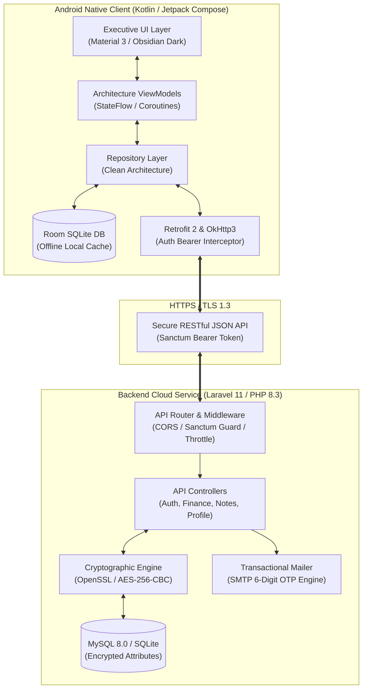
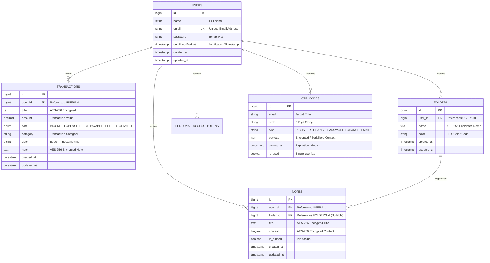

<p align="center">
  <a href="https://github.com/RyanHidayat058/MyScratch">
    
  </a>
</p>

<h1 align="center">MyScratch</h1>

<p align="center">
  <strong>Executive-Grade Personal Finance Intelligence & Zero-Knowledge Encrypted Workspace</strong>
</p>

<p align="center">
  A high-performance, privacy-first mobile and cloud ecosystem crafted for professionals. Built with <strong>Android Jetpack Compose</strong>, <strong>Clean Architecture</strong>, and backed by a hardened <strong>Laravel 11 RESTful API</strong> with native <strong>AES-256 database encryption</strong>.
</p>

<p align="center">
  <a href="https://kotlinlang.org/"></a>
  <a href="https://developer.android.com/jetpack/compose"></a>
  <a href="https://developer.android.com/training/data-storage/room"></a>
  <a href="https://laravel.com"></a>
  <a href="https://www.php.net/"></a>
  <a href="https://laravel.com/docs/11.x/sanctum"></a>
  <a href="https://csrc.nist.gov/publications/detail/sp/800-38a/final"></a>
  <a href="https://www.docker.com/"></a>
</p>

---

## Table of Contents

- [Overview](#overview)
- [System Architecture](#system-architecture)
- [Key Features](#key-features)
  - [1. Personal Finance Intelligence](#1-personal-finance-intelligence)
  - [2. Zero-Knowledge Encrypted Notes](#2-zero-knowledge-encrypted-notes)
  - [3. Hardened Identity & Security Lifecycle](#3-hardened-identity--security-lifecycle)
  - [4. Executive UX & Responsive Scaffolding](#4-executive-ux--responsive-scaffolding)
- [Cryptographic & Privacy Model](#cryptographic--privacy-model)
- [Entity Relationship Diagram (ERD)](#entity-relationship-diagram-erd)
- [Monorepo Structure](#monorepo-structure)
- [RESTful API Specification](#restful-api-specification)
- [Getting Started](#getting-started)
  - [Prerequisites](#prerequisites)
  - [Backend Setup (Laravel 11)](#backend-setup-laravel-11)
  - [Frontend Setup (Android Native)](#frontend-setup-android-native)
  - [Running with Docker](#running-with-docker)
  - [Deploying to Vercel](#deploying-to-vercel)
- [Environment Configuration](#environment-configuration)
- [Technology Matrix](#technology-matrix)
- [Security Disclosure](#security-disclosure)
- [Authors & License](#authors--license)

---

## Overview

MyScratch is designed from the ground up for individuals who prioritize financial discipline and personal data privacy. Unlike conventional tracking apps that store raw notes and financial records in plain text or rely on ad-driven telemetry, MyScratch couples an executive Obsidian Dark interface on Android with an enterprise-grade, self-hostable Laravel 11 backend.

### Architectural Highlights
* **Zero-Trust At-Rest Storage**: Note titles, contents, folders, and transaction memos are encrypted with AES-256-CBC before writing to the database disk.
* **Offline-First Resilience**: Local caching powered by Room Database ensures instant startup, zero latency, and reliable offline usability.
* **Fintech Analytical Engine**: Comprehensive multi-category cash flow engine supporting Income, Expense, Debt Payable, and Debt Receivable with dynamic visual charts.
* **Adaptive Multi-Form Factor**: Seamlessly scales from smartphones with ergonomic bottom bars to wide-screen tablets with collapsible navigation rails and dual-pane editors.

---

## System Architecture

The following diagram illustrates the interaction between the Android client, cloud backend, cryptographic layer, and external delivery channels:



---

## Key Features

### 1. Personal Finance Intelligence
* **Multi-Vector Ledger**: Records transactions across 4 classifications:
  * **Income**: Revenue, payroll, investments, dividends.
  * **Expense**: Operations, living costs, discretionary spending.
  * **Debt Payable (`DEBT_PAYABLE`)**: Monies owed to creditors and other parties.
  * **Debt Receivable (`DEBT_RECEIVABLE`)**: Monies owed to you by others.
* **Instant Net Worth Assessment**: Automatically calculates real-time liquidity:
  $$\text{Net Worth} = (\text{Total Income} - \text{Total Expense}) + \text{Debt Receivable} - \text{Debt Payable}$$
* **Interactive Dynamic Donut Charts**: Live visual breakdown of categorical expenditures with precise percentages and distinct color legends.
* **Quick Temporal Filtering**: Instant slicing across All, This Month, This Week, and Today.
* **Embedded Pop-up Calculator**: Floating modal calculator supporting chained arithmetic calculations (`+`, `-`, `*`, `/`, `%`) with a single-tap **"Apply Value"** button to auto-fill transaction inputs.

### 2. Zero-Knowledge Encrypted Notes
* **AES-256 At-Rest Encryption**: Notes and notebook folders are encrypted transparently by the backend before writing to disk. Even with direct database access, records remain indecipherable without the cryptographic master key.
* **Structured Organization**:
  * Color-coded custom folders with HEX accent palettes.
  * Note pinning to keep high-priority records accessible.
  * Real-time search across titles and contents.
* **Dual-Pane Tablet Experience**: Split-screen master-detail layout allowing users to browse their notebook hierarchy on the left while editing on the right.

### 3. Hardened Identity & Security Lifecycle
* **Two-Step Registration with Email OTP**: Account creation verified using cryptographically generated 6-digit one-time tokens delivered via SMTP.
* **Stateful Bearer Token Auth**: Powered by Laravel Sanctum for revokable, high-entropy tokens.
* **Self-Service Security Operations**:
  * Request password reset with OTP validation.
  * In-app email migration requiring dual verification to prevent account takeover.
  * Complete GDPR-compliant account and data erasure endpoint.

### 4. Executive UX & Responsive Scaffolding
* **Fintech Aesthetics**: Dark Obsidian palette (`#0F172A`, `#1E293B`) paired with Emerald accents (`#10B981`, `#059669`) engineered for minimal eye strain and high legibility.
* **Pure Vector Iconography**: 100% vector-based Material Design icons maintain a clean, corporate atmosphere with no cartoonish elements.
* **Adaptive Breakpoints**:
  * **Phone (< 600dp)**: Ergonomic bottom navigation and swipe-friendly card lists.
  * **Tablet / Foldable (≥ 600dp)**: Collapsible navigation rail and multi-column grid layouts.

---

## Cryptographic & Privacy Model

Security is built directly into the data architecture:

| Layer | Implementation | Purpose |
| :--- | :--- | :--- |
| **Transport Layer** | TLS 1.3 / HTTPS | Protects credentials and payloads in transit from MITM attacks |
| **Authentication** | Laravel Sanctum (SHA-256 Tokens) | Revokable API tokens stored securely on Android using EncryptedSharedPreferences |
| **Database Encryption** | AES-256-CBC (`casts: encrypted`) | Encrypts `notes.title`, `notes.content`, `folders.name`, `transactions.title`, and `transactions.note` |
| **Password Hashing** | Bcrypt (Rounds = 12) | Salted one-way key derivation |
| **Verification Tokens** | 6-Digit High-Entropy OTP (TTL: 5 min) | Ephemeral single-use codes invalidated after consumption |

---

## Entity Relationship Diagram (ERD)



---

## Monorepo Structure

```
MyScratch/
├── FRONTEND/                           # Native Android Client
│   ├── app/
│   │   ├── src/main/java/com/myscratch/app/
│   │   │   ├── data/
│   │   │   │   ├── local/              # Room DB, DAOs & Entities
│   │   │   │   ├── network/            # Retrofit Service, Auth Interceptors, DTOs
│   │   │   │   └── repository/         # Repository Implementations
│   │   │   ├── domain/                 # Pure Domain Models & Repository Contracts
│   │   │   ├── ui/
│   │   │   │   ├── auth/               # Login, Register & OTP Verification Screens
│   │   │   │   ├── components/         # DonutChart, PopupCalculator, ClassyCard, Scaffold
│   │   │   │   ├── finance/            # Dashboard, Transaction History, Add/Edit
│   │   │   │   ├── home/               # Central Workspace Hub
│   │   │   │   ├── navigation/         # Jetpack Navigation Graph & Destinations
│   │   │   │   ├── notes/              # Notes Catalog & Rich Editor
│   │   │   │   ├── profile/            # Profile, Security, Credentials Settings
│   │   │   │   └── theme/              # Obsidian & Emerald Material 3 Design System
│   │   │   └── viewmodel/              # AuthViewModel, FinanceViewModel, NotesViewModel
│   │   └── build.gradle.kts            # Android Build & Dependency Definitions
│   └── build.gradle.kts
│
├── BACKEND/                            # Laravel 11 RESTful API Service
│   ├── app/
│   │   ├── Http/Controllers/Api/       # AuthController, FinanceController, NotesController, ProfileController
│   │   ├── Mail/                       # OtpVerificationMail (Mailable)
│   │   └── Models/                     # User, Transaction, Folder, Note, OtpCode
│   ├── database/
│   │   └── migrations/                 # Schema Definitions with Encrypted Types
│   ├── resources/views/emails/         # Custom Responsive HTML Email Templates
│   ├── routes/
│   │   └── api.php                     # Sanctum Guarded Endpoints
│   ├── Dockerfile                      # Standalone PHP 8.3 CLI Container Definition
│   └── vercel.json                     # Serverless Runtime Configuration
│
├── Dockerfile                          # Root Multi-Stage Dockerfile
├── logo.png                            # Official Application Icon
└── README.md                           # Master Project Documentation
```

---

## RESTful API Specification

All protected endpoints require an `Authorization: Bearer <token>` HTTP header.

### 1. Authentication & Security
| HTTP | Endpoint | Auth | Description |
| :--- | :--- | :---: | :--- |
| `POST` | `/api/auth/register-request` | Public | Initiates registration and dispatches 6-digit OTP to user email |
| `POST` | `/api/auth/verify-register-otp` | Public | Validates OTP and creates user account |
| `POST` | `/api/auth/resend-register-otp` | Public | Regenerates a fresh OTP code |
| `POST` | `/api/auth/login` | Public | Authenticates credentials and issues Sanctum bearer token |
| `POST` | `/api/auth/logout` | Required | Revokes the caller's active bearer token |

### 2. User Profile Management
| HTTP | Endpoint | Auth | Description |
| :--- | :--- | :---: | :--- |
| `GET` | `/api/user/profile` | Required | Retrieves profile details for authenticated user |
| `POST` | `/api/user/change-password-request` | Required | Dispatches password change OTP |
| `POST` | `/api/user/change-password-verify` | Required | Verifies OTP and applies new password |
| `POST` | `/api/user/change-email-request` | Required | Dispatches migration OTP to target email |
| `POST` | `/api/user/change-email-verify` | Required | Verifies OTP and commits email update |
| `DELETE` | `/api/user/delete-account` | Required | Permanently wipes user account and related records |

### 3. Finance Engine
| HTTP | Endpoint | Auth | Description |
| :--- | :--- | :---: | :--- |
| `GET` | `/api/finance/summary` | Required | Computes aggregate totals, balance, net worth, and chart data |
| `GET` | `/api/finance/transactions` | Required | Lists transactions with optional filters (`type`, `category`, `search`) |
| `POST` | `/api/finance/transactions` | Required | Creates a new transaction record (encrypted title & note) |
| `PUT` | `/api/finance/transactions/{id}` | Required | Updates an existing transaction record |
| `DELETE` | `/api/finance/transactions/{id}` | Required | Deletes a transaction record |

### 4. Secure Notes & Folders
| HTTP | Endpoint | Auth | Description |
| :--- | :--- | :---: | :--- |
| `GET` | `/api/notes/folders` | Required | Fetches user folders with active note counts |
| `POST` | `/api/notes/folders` | Required | Creates a new folder with color tag |
| `DELETE` | `/api/notes/folders/{id}` | Required | Deletes a folder |
| `GET` | `/api/notes` | Required | Retrieves notes with optional folder or search filters |
| `POST` | `/api/notes` | Required | Stores a new note with AES-256 encrypted title & body |
| `PUT` | `/api/notes/{id}` | Required | Modifies title, body, pinned state, or folder relation |
| `DELETE` | `/api/notes/{id}` | Required | Deletes a note permanently |

---

## Getting Started

### Prerequisites
* **Mobile**: Android Studio Hedgehog (2023.1.1+) or newer with **JDK 17**.
* **Server**: PHP 8.3+ and Composer (or Docker).
* **Database**: MySQL 8.0+ (or SQLite for local development).

---

### Backend Setup (Laravel 11)

1. **Navigate to the backend directory**:
   ```bash
   cd BACKEND
   ```

2. **Install PHP dependencies**:
   ```bash
   composer install --optimize-autoloader
   ```

3. **Configure the environment file**:
   ```bash
   cp .env.example .env
   php artisan key:generate
   ```

4. **Update database and mail settings in `.env`**:
   ```env
   DB_CONNECTION=mysql
   DB_HOST=127.0.0.1
   DB_PORT=3306
   DB_DATABASE=myscratch
   DB_USERNAME=root
   DB_PASSWORD=your_password

   MAIL_MAILER=smtp
   MAIL_HOST=smtp.gmail.com
   MAIL_PORT=587
   MAIL_USERNAME=your_email@gmail.com
   MAIL_PASSWORD=your_app_password
   MAIL_ENCRYPTION=tls
   MAIL_FROM_ADDRESS="no-reply@myscratch.app"
   MAIL_FROM_NAME="MyScratch Security"
   ```

5. **Run database migrations**:
   ```bash
   php artisan migrate
   ```

6. **Start local development server**:
   ```bash
   php artisan serve --host=0.0.0.0 --port=8000
   ```
   The API will be accessible at: `http://localhost:8000/api/`

---

### Frontend Setup (Android Native)

1. **Open the project in Android Studio**:
   * Launch Android Studio, select **File > Open**, and select the `FRONTEND` directory.

2. **Configure API Base URL**:
   * In `app/src/main/java/com/myscratch/app/data/network/ApiClient.kt`:
     * For **local emulator testing**: set `baseUrl = "http://10.0.2.2:8000/api/"`
     * For **physical device testing**: set `baseUrl = "http://<YOUR_LOCAL_IP>:8000/api/"`
     * For **cloud production**: set `baseUrl = "https://your-production-domain.com/api/"`

3. **Build & Run**:
   * Select your target emulator or physical device.
   * Click **Run (Shift + F10)** or build the debug APK via Gradle:
     ```bash
     cd FRONTEND
     ./gradlew assembleDebug
     ```
   * The generated APK is located at: `app/build/outputs/apk/debug/app-debug.apk`.

---

### Running with Docker

Deploy the backend container with zero local dependency conflicts:

```bash
# Build Docker image
docker build -t myscratch-backend .

# Run container exposing port 8000
docker run -d \
  -p 8000:8000 \
  --name myscratch-api \
  -e APP_KEY=base64:YOUR_GENERATED_APP_KEY \
  -e DB_CONNECTION=sqlite \
  myscratch-backend
```

---

### Deploying to Vercel

The backend includes native Vercel serverless integration via `vercel-php`:

1. Install the Vercel CLI:
   ```bash
   npm i -g vercel
   ```
2. Deploy from the `BACKEND` directory:
   ```bash
   cd BACKEND
   vercel --prod
   ```
3. Set your environment variables (`APP_KEY`, `DB_HOST`, `MAIL_*`) directly in the Vercel Project Dashboard.

---

## Environment Configuration

| Variable | Default | Purpose |
| :--- | :--- | :--- |
| `APP_NAME` | `MyScratch` | Application identifier in headers and transactional emails |
| `APP_ENV` | `production` | Environment mode (`local`, `production`) |
| `APP_KEY` | *(Required)* | 32-character cryptographic key for AES-256 encryption |
| `APP_URL` | `http://localhost:8000` | Canonical application URL |
| `DB_CONNECTION` | `mysql` | Database driver (`mysql`, `sqlite`, `pgsql`) |
| `MAIL_MAILER` | `smtp` | Mail transport protocol |
| `MAIL_HOST` | `smtp.gmail.com` | SMTP gateway host |
| `MAIL_PORT` | `587` | SMTP port (e.g. 587 for TLS, 465 for SSL) |
| `MAIL_USERNAME` | `null` | SMTP authentication user |
| `MAIL_PASSWORD` | `null` | SMTP authentication password or App Password |

---

## Technology Matrix

| Domain | Technology / Library | Version / Standard |
| :--- | :--- | :--- |
| **Android Language** | Kotlin | `2.0.0` |
| **UI Toolkit** | Jetpack Compose & Material 3 | AndroidX Compose BOM |
| **Architecture** | MVVM + Clean Architecture | Repository Pattern + Unidirectional Data Flow |
| **Asynchronous** | Kotlin Coroutines & Flow | `StateFlow` / `SharedFlow` |
| **Local Persistence** | Room Database | SQLite with Room KSP Compiler |
| **Networking** | Retrofit 2 + OkHttp 3 + Gson | HTTP/2, Logging & Auth Interceptors |
| **Backend Framework** | Laravel Framework | `11.x` |
| **Server Language** | PHP | `8.3+` |
| **Authentication** | Laravel Sanctum | Stateful Token Authentication |
| **Database** | MySQL / SQLite | UTF8mb4, InnoDB Engine |
| **Containerization** | Docker | Alpine Linux `php:8.3-cli-alpine` |
| **Cloud Deployment** | Vercel Serverless | `vercel-php@0.7.4` |

---

## Security Disclosure

If you discover any security vulnerabilities or cryptographic flaws within MyScratch, please send an advisory email directly to **[ryan.hidayat058@gmail.com](mailto:ryan.hidayat058@gmail.com)** or open a confidential issue on GitHub. All security advisories are addressed promptly.

---

## Authors & License

* **Lead Architect & Developer**: **Ryan Hidayat** ([@RyanHidayat058](https://github.com/RyanHidayat058))
* **Copyright**: &copy; 2024 - 2026 Ryan Hidayat. All rights reserved.
* **License**: Distributed under the **MIT License**. See `LICENSE` for details.
